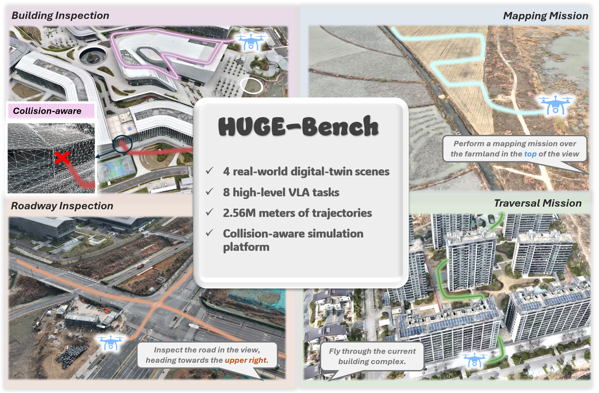

<div align="center">

# HUGE-Bench: A Benchmark for High-Level UAV Vision-Language-Action Tasks


</div>

<p align="center">
  
</p>

## Overview

HUGE-Bench targets high-level UAV vision-language-action tasks, where agents must ground brief, potentially ambiguous commands into safe, multi-stage behaviors. HUGE-Bench contains 4 real-world digital twin scenes, 8 high-level tasks, and 2.56M meters of trajectories. It is built on an aligned 3DGS-Mesh representation that combines photorealistic rendering with collision-capable geometry, enabling scalable data generation and collision-aware evaluation.

We open-source HUGE-Bench to provide the community with a UAV simulation learning platform that is easy to configure, high-fidelity, and collision-aware. We hope researchers can build on this benchmark to train and evaluate UAV VLA tasks in a practical and reproducible setting.

## ToDo

- [x] Release `HUGE_Dataset_v0`, adapted for `pi0` training, including the trajectory dataset and a 3DGS inference environment.
- [ ] Release `HUGE_Dataset_v1` with depth, subtask labels, and a 3DGS-Mesh digital twin environment.
- [ ] Release model weights and trajectory collection scripts.
- [ ] ...

## Dataset

`HUGE_Dataset_v0` is released in LeRobot format, it can be used directly with the `pi0` training pipeline.

- Trajectory Dataset release: [Download](https://huggingface.co/datasets/yu781986168/HUGE_PI)
- 3DGS Inference Environment release: [Download](https://huggingface.co/datasets/yu781986168/HUGE_3DGS)

## Training with PI0

Please set up the training environment by following the official [OpenPi repository](https://github.com/Physical-Intelligence/openpi).

Once the OpenPi environment is ready, you can train directly on `HUGE_Dataset_v0` because the dataset already follows the LeRobot format expected by the pipeline.


## 3DGS-Based Environment

For 3DGS-based rendering and inference, please set up the official [Gaussian Splatting repository](https://github.com/graphdeco-inria/gaussian-splatting) first:

Note:
1. `3dgs_renderer.py` and `my_render_traj.py` depend on the Gaussian Splatting codebase and should be used inside the `gaussian-splatting/` project.
2. `action_infer.py` depends on OpenPi and should be used inside the `openpi/scripts/` directory.

## Inference and Evaluation

Start the 3DGS render server in the Gaussian Splatting environment:

```bash
CUDA_VISIBLE_DEVICES=0 python 3dgs_renderer.py --host 127.0.0.1 --port 5550
```

Then run rollout inference in the OpenPI environment:

```bash
CUDA_VISIBLE_DEVICES=1 uv run scripts/action_infer.py \
  --task_id obstacle \
  --config_name pi0_obstacle \
  --checkpoint_dir /path/to/checkpoint \
  --host 127.0.0.1 \
  --port 5550
```

You will likely need to adapt dataset paths, checkpoint paths, and rendering templates to your local setup.

## Output Structure

The rollout script saves results by task, split, environment, and episode:

```text
<out_dir>/
└── task_<task_id>/
    └── <split>/
        └── <env_id>/
            └── episode_<episode_index>/
                ├── compare_gt_vs_pred_3d.png
                ├── traj_gt_pred_xyzk.npz
                ├── instruction.txt
                ├── pred_video.mp4
                └── gt_video.mp4
```

Where:

- `compare_gt_vs_pred_3d.png` visualizes the predicted and ground-truth trajectories in 3D.
- `traj_gt_pred_xyzk.npz` stores the aligned trajectory arrays, including `gt_xyzk` and `pred_xyzk`.
- `instruction.txt` records the prompt, split, environment id, checkpoint, and evaluation settings used for that episode.
- `pred_video.mp4` is the rendered rollout video from the predicted trajectory.
- `gt_video.mp4` is the rendered rollout video from the ground-truth trajectory.

## Acknowledgements

- [Physical-Intelligence/openpi](https://github.com/Physical-Intelligence/openpi)
- [graphdeco-inria/gaussian-splatting](https://github.com/graphdeco-inria/gaussian-splatting)
